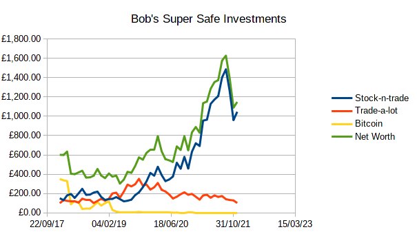

## Background

Bob trusts you a lot now.  So much he's prepared to hire you properly.  He wants
you to sort out his accounts (so he's got some idea where he stands if HMRC come
knocking).  And they *will* come knocking, because Bob is being audited (he just
doesn't know it yet).

Bob has his account data all over the place.  To be helpful I've put it all into
text documents (csvs) for you.  In reality he would send you some files, some
emails, some word documents, and some stuff you would have to type in manually.

Bob is not very good with money.  But fortunately he hires people who are (like
you).  For instance, his investment manager recently sent him this image of his
holdings:

Bitcoin was a waste of money.  I could have told you that.  But Bob should
really put more money into investments.  His ISA makes nothing (rather like
mine).  Since we want this course to finish at some point, I haven't given you
his account details, only his cash flow.

!!! Note

    You might be interested in how I generated all this data.  I used [a
    spreadsheet](bob-data.ods)!  Since this is a course I'm doing in my spare
    time, I generated everything with `randbetween(start_int, end_int)` and
    tweaked the numbers to give the investments plausible trajectories.  Then I
    just refreshed the columns until I got data I liked and copied them to the
    `investments-static` sheet.
    
## Data sources

Here is all the data I'm going to give you:

| File                                | Meaning                                                                                                                              |
|-------------------------------------|--------------------------------------------------------------------------------------------------------------------------------------|
| [motoring.csv](motoring.csv)        | Bob's silly car                                                                                                                      |
| [mortgages.csv](mortgages.csv)      | Bob's Mortgage Payments                                                                                                              |
| [holidays.csv](holidays.csv)        | Bob's Holidays (he only travels at Christmas!)                                                                                       |
| [judo.csv](judo.csv)                | The money Bob earned over the last two years at judo matches and training (Entered in 3 groups by day of the year, because I'm lazy) |
| [rugby.csv](rugby.csv)              | The same, for rugby                                                                                                                  |
| [investments.csv](investements.csv) | Bob's investment worth (he doesn't cash out)                                                                                         |
| [overtimes.csv](overtimes.csv)      | The overtime *hours* Bob worked (his saalary doesn't change)                                                                         |

In addition, Bob has some 'standard' expenditures:

- his car (same mileage as before) does a mere 35 miles a week, on average.  Bob
  lives in London, and has his car as a status symbol.  It's a waste of money
  and is hurting the planet, but Bob is thinking of investing in green energy
  and buying a stuffed Panda toy, so his conscience is clean.
- his council tax (same as before)
- his groceries (same as before)

Alright, so it's unlikely he would spend *exactly* the same amount every week,
but I got bored of entering `randbetween()`.  I tell you what, *you* can make up
some random data!  (See the first exercise.)

He also has standard earnings:

- Except for 5 days off at Christmas and every weekend, Bob works his standard
  hours for a given day unless you have and entry for it in the csv above.
- On his birthday (17 February) Aunt Mabel sends him a £5 book voucher.  You
  don't need to account for that.  Bob never spends it anyhow, as he never reads
  books.  Instead he uses the vouchers as wallpaper.  So far he has managed to
  wallpaper the guest bedroom, the under-stairs cupboard, and half the hallway.
  Visitors think it strange---but thanks to Lockdown, Bob hasn't been getting many.

## Following these exercises

Each exercise builds on the previous.  I suggest you make a folder (or
directory) for them, and name your first spreadsheet something like `ex1.ods`.
Then when working on the second exercise, save-as `ex2.ods` (etc).  Be careful
not to overwrite your previous work: you will likely want it for reference.
